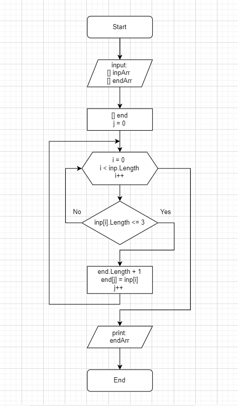

## Задача: 

Написать программу, которая из имеющегося массива строк формирует массив из строк, длина которых меньше либо равна трём символам. Первоначальный массив можно ввести с клавиатуры, либо задать на старте выполнения алгоритма. При решении не рекомендуется пользоваться коллекциями, лучше обойтись исключительно массивами.

На примере: ["'hello", "2", "world", " :-)"] -> ["2", ":-)"]

## Описание решения:

В начале алгоритма задается первый массив, с именем **inpArr**, который сразу же выводится на печать. Затем создается второй массив, с именем **endArr**, который заполняется результатом работы метода **DesArr** и затем также выводится на печать.

**Метод DesArr**

В начале работы метода создается пустой массив **end** и счетчик **j** к нему. 
Затем проверяется каждый элемент в цикле (от нуля до конца массива). 
Если длина строки, которая хранится в каждом элементе массива меньше или равна трём, то:

+ длина массива **end** увеличивается на еденицу;

+ элементу массива **end** присваивается **j**-ое  значение, а элементу массива **inp** значение **i** ;

+ счетчик **j** увеличивается на еденицу:

+ при выходе из цикла массив **end** возвращается.
____

## Код на C#: 

____

## Блок - схема алгоритма: 
